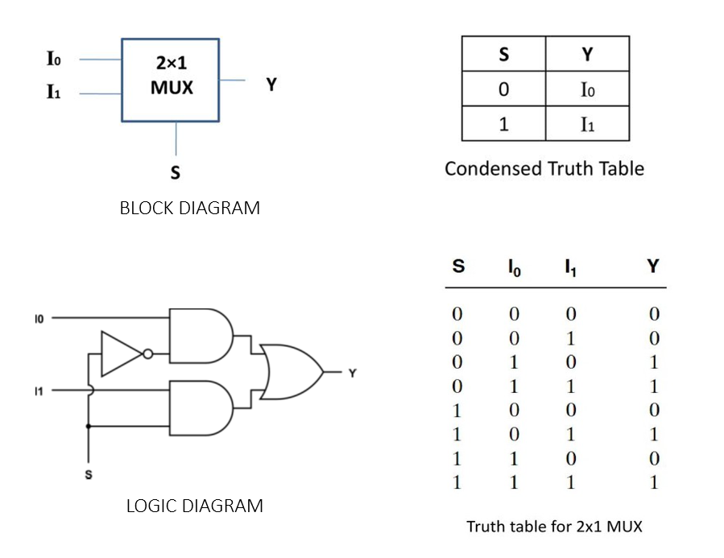

### THEORY

### Stuck At Faults

Stuck at fault is an abstract fault model. It is considered as a logic level fault during a Boolean function implementation. It is basically used by the simulators to mimic manufacturing defects within an integrated circuit. Hence, SAF represents physical faults. There are two sorts of SAFs: SA0 (stuck-at-zero) and SA1 (stuck-at-one) faults.

The signal is said to be "stuck at fault" when it is stuck at 0 or 1 value regardless of the inputs to the circuit, and the fault model used to represent this type of error is called a "stuck at fault" model. Stuck at fault refers to any terminal that is stuck at logic '0' or '1'. These faults are known as Stuck at 0 (SA0) and Stuck at 1 (SA1) respectively. It does not rely on input or output values at that terminal.

### Multiplexer

A multiplexer is a circuit that combines numerous input lines with a single output line. It's a combinational circuit that has a single output line, n selection lines and a maximum of 2n data inputs. These n selection lines form 2n possible combinations which enable the selection of a single input line among 2n data inputs. The binary data is collected from the input line and sent to the output line. One of these data inputs will be connected to the output based on the combination of the values of the selection lines.

### 2x1 Multiplexer (Mux)

2x1 mux is a multiplexer with 2 data inputs (I0 and I1), a selection line (S) and an output variable (Y). The output is linked to either of the inputs depending on the select signal. Since there are two input signals, only two ways are possible to connect the inputs to the outputs, so one select is needed to do these operations. Below is a picture depicting the block diagram, logic diagram and corresponding truth table for 2x1 mux.

##### Boolean function for Y:

Y = SI0 + SI1
Condensed truth table shown in the above figure clearly explains how selector variable (S) selects I0 when S = 0 and I1 when S = 1.
Implementation of a 2x1 mux requires and inverter, 2 AND gates and an OR gate.
